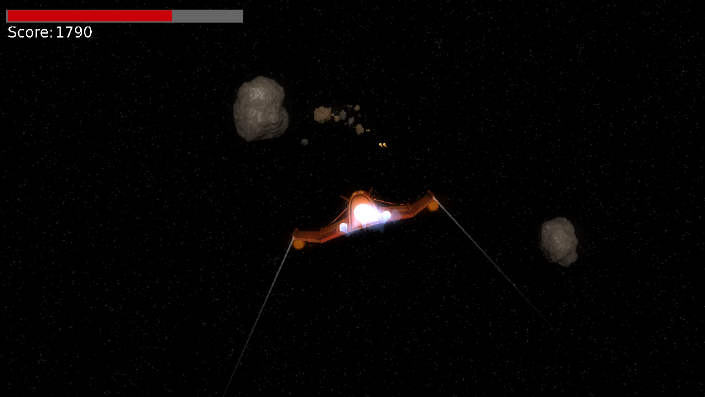

# Space Shooter Game

A fun endless-runner-style game where you have to dodge asteroids and pick up health to survive, all the while shooting asteroids to get points.

## Getting started

To play the game, download this repository and open SpaceShooter.blend in Blender.
With your mouse inside the window, press P and the game will start.

I recommend you use Blender [version 2.74](https://download.blender.org/release/Blender2.74/).
The game works with similar versions, but in some versions the lighting is brighter than intended and in more recent versions the game won’t play at all.
The image above and [this video](https://youtu.be/K2W10eKlG0Y) show what playing the game is supposed to look like.

## Gameplay

Move your spaceship with the arrow keys, and click or hold the left mouse button to shoot.
The escape key also lets you quit the game.

Your health bar is in the top left and when you run out of health it’s game over.
If you get hit by an asteroid you lose health, and the bigger the asteroid the more damage you take.
Pick up health packs to regain health.

Shoot asteroids to increase your score; smaller asteroids give you more points.
Don’t shoot health packs or you’ll destroy them!
The longer you last, the faster the asteroids will keep coming.
Try to get as many points as you can before game over.

## Background

This game was made for the purpose of an [Extended Project Qualification (EPQ)](https://en.wikipedia.org/wiki/Extended_Project_Qualification) in 2014-2015.
If you’re interested in the game’s design and development process then take a look at the [PowerPoint presentation with notes](Presentation.pptx) and the [short report](Report.pdf).

The game has not been altered since 2015 but has now been released online in 2020.
But feel free to contribute or request features and bug fixes if you feel like it.

* GitHub: <https://github.com/willplatt/space-shooter/>
* Bitbucket: <https://bitbucket.org/WillPlatt/space-shooter/>

## License

I have chosen to license this project under the [MIT license](LICENSE.txt) to give the most freedom for people to modify and redistribute this game.